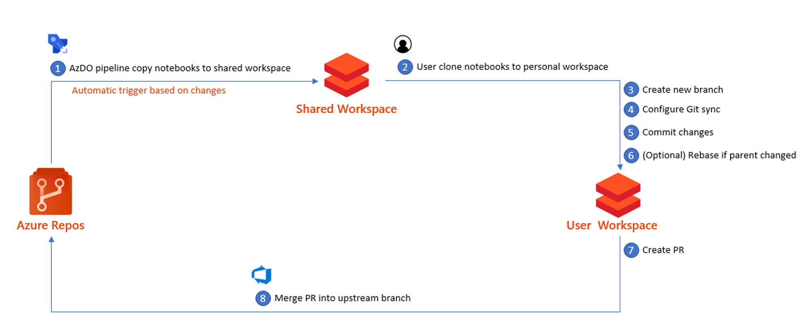
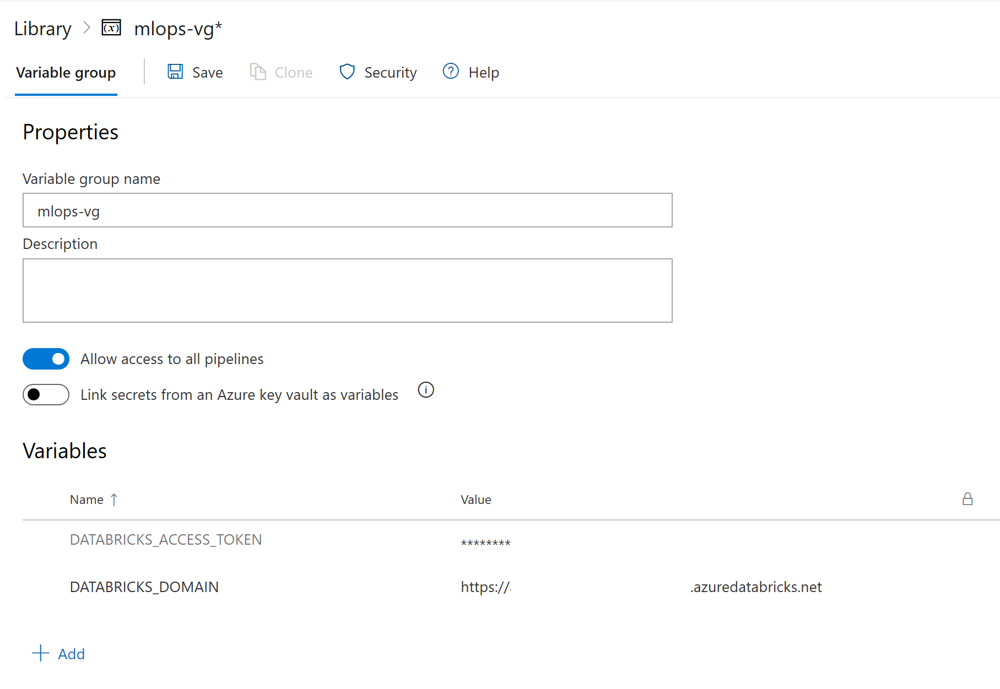
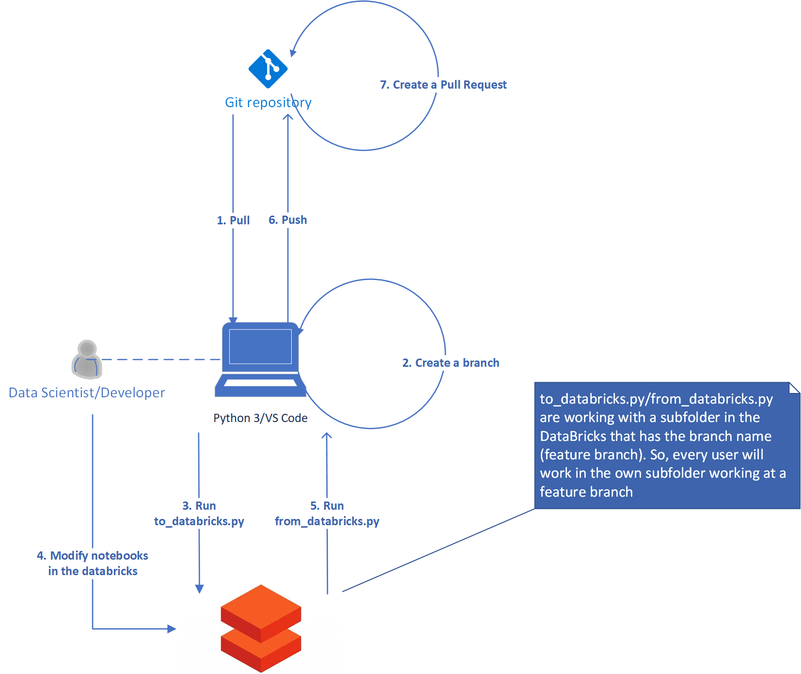

# DataBricks <-> Azure DevOps Integration #

The goal of this document is to show how to use Git and Databricks together. There are two approaches:

- DataBricks centric approach: recommended if the Databricks interface is the primary development tool
- Dev Tools centric approach: recommended if using a local IDE like VSCode, PyCharm or any other along with the Databricks interface.

## DataBricks Centric Approach ##



To implement this, we need to make sure that we always have the latest version of the master branch in DataBricks. To do this, we create an Azure DevOps Pipeline for the [master branch sync](/.azure_pipelines/sync_master_alt.yml). This pipeline uses the DataBricks CLI, configures the connection to DataBricks, and imports the `notebooks` folder from the repository to `/Shared/master` in DataBricks. Prior to setting up the pipelines, a variable group needs to be created with the following variables:

- DATABRICKS_TOKEN (secret): a secure token generated from the DataBricks UI. This parameter should be marked as a secret.
- DATABRICKS_HOST: a DataBricks host name that can be retrieved from Azure Portal;
- MASTER_BRANCH_SYNC_DIRECTORY: name of the directory in a DataBricks workspace to sync with master branch of repo
- ROOT_EXP_DIR: the root directory folder to hold experiments



Once you have created and configured the variable group, you can create the Build pipelines, which will be triggered to run when there are changes made to the **notebooks** directory in the **master** branch.

When all notebooks in master branch and in DataBricks are in sync, you can clone any of the notebooks into your own DataBricks workspace and associate it with the Git repository pointed your local branch. Doing this, it is important to replicate the same folder structure that you are planning to have in the master branch.

Some details about how to link a notebook to Azure DevOps are available [here](https://docs.microsoft.com/en-us/azure/databricks/notebooks/azure-devops-services-version-control)

## Dev Tools Centric Approach ##



This approach relies on using a local computer as a primary client to do git commits and manage branches. You can use a console or an advanced editor like Visual Studio Code to execute git commands.

As a first step, pull the git repository and create a feature branch.

Now, you can start modifying the code. However, in order to make changes to code in DataBricks, you will need to push your branch. We have developed two scripts (`to_databricks.py` and `from_databricks.py`) that allow you to move all your notebooks to a DataBricks folder tied to a git branch and back. Using this approach, you can create a unique set of notebooks that will be associated with your branch.

The script `from_databricks.py` does not take in any arguments, but `to_databricks.py` has an optional argument `--overwrite`. This parameter allows you to avoid overwriting of existing files in DataBricks by mistake.

Before running the scripts, you need to create the following environment variables:

- DATABRICKS_HOST: Dataricks host name
- DATABRICKS_TOKEN: A DataBricks Access Token
- NOTEBOOK_FOLDER: A folder to sync from the local computer
- USER: A user name (uses the USERS/USER folder to copy notebooks)
- PROJECT_FOLDER: Root folder where the project is located on the local computer

The variables can be added to an `.env` file. We added this file to `.gitignore` to avoid pushing it by mistake. `env.sample` is a template that can be followed to build out a `.env` file.

To run the script, you need to open your console in the project root folder and execute the following command:

```bash
python databricks-sync/to_databricks.py
```

## Additional Resources ##

If you use Visual Studio Code as a primary development tool, there is the [VS Code Extension for Databricks](https://marketplace.visualstudio.com/items?itemName=paiqo.databricks-vscode). This extension is open sourced and provides a good integration for Azure DataBricks in VS Code. The only drawback is it currently does not allow you to sync code to a branch related folder. This means that you cannot preserve code files for all your branches - the tool will overwrite them. At the same time, we think that it is possible to modify the extension to utilize branch names. To do that, we recommend to start with [this file](https://github.com/paiqo/Databricks-VSCode/blob/master/src/DatabricksWorkspaceTreeProvider.ts) and use a branch name rather than the root folder there.
