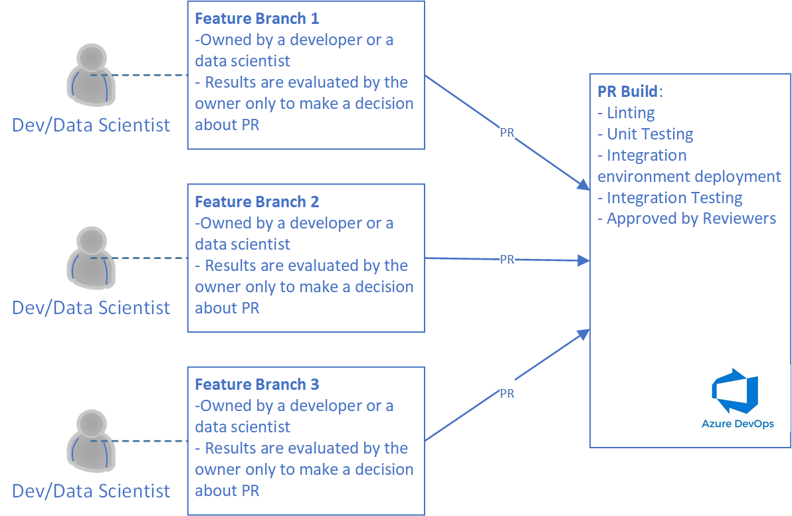
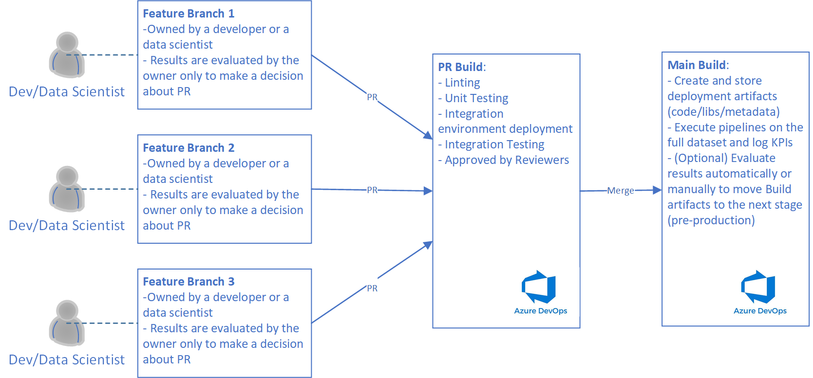
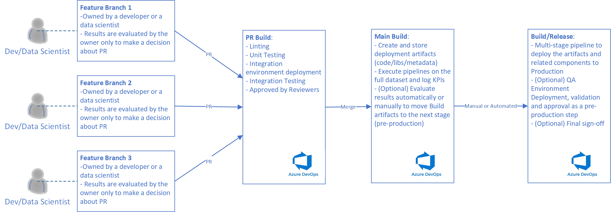
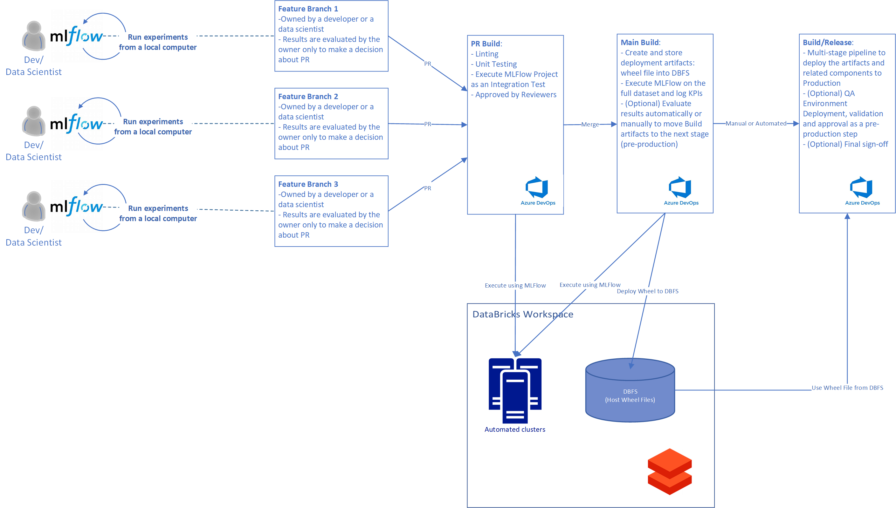

# MLOps Architecture for Data Science projects with no models #

The goal of this document is to describe how to adopt Machine Learning Development and Operations (MLOps) process to Databricks based data science projects with no model training as an output.

## Introduction ##

In the standard MLOps process we are working at two primary artifacts: ML Pipeline and a model. ML Pipeline itself is a one-step or multi-step workflow that might include data preprocessing steps, training, validation and others, and the model is the output of the  pipeline. That's why when we are designing the development process, we use ML Pipeline as a centerpiece of the process, and we use the model as the primary artifact to do deployment from the development environment to production. Designing MLOps in this way we are trying to solve the following challenges:

- Developers and Data Scientists should be able to run several experiments in parallel applying own modifications to improve the quality of the model: it's important to make sure that it will be easy to find own experiments and, experiments should not interact each other.
- Integration tests should be run prior to update the main branch to guarantee that even a complex pipeline (distributed between several steps) will work fine.
- Even if a complex pipeline works fine, it doesn't mean that its output is going to production since the output should pass quality tests as well including some manual approvals: for example, we need to check that a new model is better rather than a model that is in production now.
- Pipeline output should be validated and it should be a way to update the production environment.

At the same time if we are running a project where we are not training any model, we still can apply the standard MLOps process. The only requirement there, we should have a pipeline that implements a data science process/algorithm that can be deployed to production rather than a model.

A good example of such the task is a data analytics process that should be executed in the production environment itself. In this case we are setting up the development process as usual, having in mind that any changes to our ML (or data analytics) pipeline can bring improvements to the existing algorithm as well as decrease the performance of it. So, we still need to implement validation strategy to make sure that we will deploy to production the best version only. The only difference there is the deployment artifact: we are deploying not a model, but the pipeline itself to execute it on new data.

Let's discuss MLOps workflow having in mind that we have to deploy a pipeline rather than a model to production.

## General Workflow ##

Working at code, developers create own feature branches and they are doing improvements from there. At the end of the document we will discuss how to do local development from a local computer, but as for now we assume that a developer made some changes that should be merged to the main branch from a feature branch.

So, the first step there is a PR request that should be created by the developer. On this stage we need to make sure that proposed code has a good quality and works fine. In order to do that we are executing the following tasks:

 - Linting: to check some static rules regarding to code quality.
 - Unit Tests: to check classes and methods in an isolated environment to check if they works as expected.
 - Integration tests: these tests are very important for any complex data science process where we are using many different components and services (clusters, databases, orchestrators, separate steps in the pipeline) to compute the final results. The tests can be implemented in a way where we tests subsets of the pipeline as well as the pipeline itself as the whole artifact (recommended test).
 - Code should be approved by a number of reviewers.

Below, you can find a diagram that provide visualization for the process:



Once the code from above has been merged to the main branch, we have to complete two actions:

- Execute the whole pipeline using the main branch code and a dataset that is good enough to make decisions about the merged changes (if they are better). Usually, on this stage we are talking about full dataset that can be used to collect all needed KPIs. Obviously, we need to log the KPIs in a way when it will be possible compare results to previous runs.
- Build and prepare related artifacts to make sure that we will be able to move the implementation to production as soon as it's approved. For example, if we pack all pipeline related code as a library, we just create a new version of the library and place it to a special repository applying some patterns to the version of the library. For example, if we are running our pipelines in Databricks, the library can be placed to DBFS system. This step is not different from the standard MLOps process where we are storing a model rather than a library/code.
- (Optional) Approve the artifacts from the previous step manually or automatically.



Once we have an artifact that is ready for production, we can implement a step that do the deployment. It can be done as an additional step in the previous pipeline or as a separate Build/Release process.

The final diagram might looks like this one:



## Implementation using MLFlow ##

### MLFlow Projects ###

Let's start discussing some topics that are related to implementation picking Databricks as our primary platform to execute data science pipelines.

Recently Databricks has been integrated with MLFlow that allows us to implement all MLOps related tasks with less effort. MLFlow doesn't have the "pipeline" term, but it has projects instead, where a "project" is a folder that contains all pipeline related attributes:

- MLProject file: defines all entry points to execute
- {your_name}.yaml file: defines all dependencies that should be installed on the compute cluster
- {your_name}.json file: a cluster definition
- scripts (Python/Bash): implementation of the steps

The project itself can contain pipeline implementation itself or just some basic code referencing a library(s). In the second case we treat our MLFlow project as an integration test that allows us to apply the library to a real scenario.

MLFlow SDK allows us to execute an MLFlow project in a folder on a local computer or in a git repository using just couple lines of code:

```py
# optional if experiment_id is provided
mlflow.set_experiment(experiment_folder)
mlflow.run(
        "{project_folder}",
        backend="databricks",
        backend_config="cluster.json",
        # optional if set_experiment() is called
        experiment_id ="{experiment_id}",
        parameters=...)
```

In the first line we are setting an experiment name that should include a real path in Databricks (like /User/me/my_exp_1), and the second line just put all project things altogether and execute the project on a new automated cluster. Alternatively, the experiment_id can be passed into mlflow.run() instead of setting the experiment by name. There are several benefits that we can get from the code above:

- Experiments can be generated dynamically based on your branch name. So, if we implement MLOps in a way when we use branch name as a part of the experiment name, we will be able to differentiate our experiments between different feature and dev branches.
- New automated cluster on each run allows us to make sure that we always have up-to-date dependencies.
- Because the code above can be executed using a local project folder, it easy to start the project from a local computer or from DevOps host. It means that we can test our projects using Build pipelines in Azure DevOps running them on pull requests.

Therefore, using MLFlow projects we are addressing the most of the challenges that we mentioned in the beginning.

### Wheel Approach and project folder structure ###

It's a pretty rare situation when MLFlow project contains real pipeline implementation rather than a reference to a library. So, we would recommend to start moving all ML related code to a separate folder from the beginning. In this case, you will be able to pack the folder as a wheel file that can be deployed as a part of the MLFlow project. For example, we can host all independent code in **src** folder and MLFlow projects in **mlflow-notebooks** folder. The library from **src** folder is going to be the primary artifact to be published to production, and **mlflow-notebooks** - just a folder with integration tests.

One more folder can be related to a script that we can use to start all our MLFlow projects from a local or remote environment. As we mentioned earlier, there are just two lines to start the project, but you still need to read some environment variables to establish connection to Databricks, and you need to generate an experiment name based on some patterns. So, it's better to have all these actions in a separate script in a folder like mlflow-triggers.

Therefore, we can have the following folder structure:

```
├── mlflow-triggers
├── mlflow-notebooks
│   └── databricks-project/
│       ├── cluster.json
│       ├── MLProject
│       ├── main.py
│       └── main_env.yaml
├── src
```

### Deploying experiments working in a team ###

Running experiments from different branches we need to make sure that each branch has own unique experiment name. It means that we can create the experiment name dynamically using branch name as a part of it.

It will help us to have several runs on the same branch under the same experiment name. So, we will be able to compare results between them.

### MLOPs Architecture on Databricks ###

Let's modify our initial diagram having in mind that we are using MLFlow and Databricks:



## Some Notes about Local Development ##

There are several options to test code from a local computer.

**Option 1**. Developers can use the same script that we are using in Azure DevOps to execute MLFlow project from a local computer (mlflow-triggers folder). Using this approach it's easy to compare run results staying on the same branch. The main disadvantage there: each run requires additional time to wait for an automated cluster;

**Option 2**. If a developer are not modifying the context of the wheel file, it can be deployed to an interactive cluster, and the developer will be able to open MLFlow project Python files in the Databricks UI to modify them and execute from there. The main disadvantage: it doesn't work if the developer need to change wheel file content (it will require cluster restart and wheel redeployment).

**Option 3**. It's possible to open MLFlow project Python files in DataBricks UI and clone all wheel related files (source code) into the interactive cluster. In this case you can modify the library in VS Code, pull changes to the DataBricks to see how they affect your notebooks right away with no cluster restart. The main disadvantage: git related code should be added to desired notebooks that should be removed prior the Pull Request (or you can check the execution environment: ```'PythonShell' in sys.argv[0]``` returns true in DataBricks UI). There is an example of the git related code that you can use:

```cmd
%sh

rm -fr <user folder name>

mkdir -p <user folder name>/<project folder> 2 > /dev/null

git clone https://<git username>:<git password>@<clonning uri> <user folder name>/<project folder>

cd <user folder name>/<project folder>

git checkout <branch you want to work with>
```
