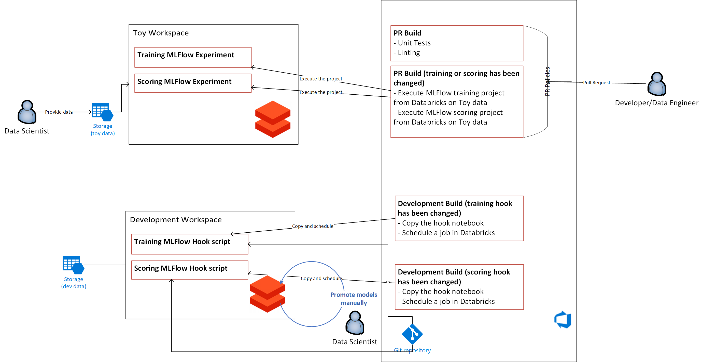
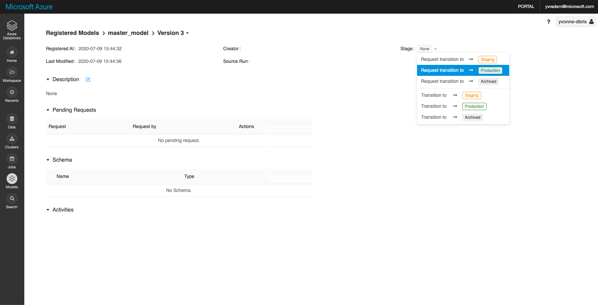

# MLOps for Batch Prediction using DataBricks #

In this document, we are going to discuss how you can implement batch predictions using DataBricks. To do this, we are going to train a model and use it to make predictions for a chunk of data on a schedule, rather than publishing the model as a runtime service. In this example, we are working with two specific example pipelines: training and scoring.

There are many different options to implement the training and scoring pipelines, but in this specific approach, we plan to use DataBricks as a compute engine. There are many reasons to use DataBricks starting from “a technology by default” standpoint to relying on notebook based coding environments for big data implementations. In this approach, we rely on services like Azure DevOps, Azure DataBricks and MLFlow.

## MLFlow Projects in a DataBricks Centric Approach ##

In a Databricks centric approach, we need to design MLOps primarily using DataBricks features. DataBricks has integration with MLFlow that allows us to build MLOps processes using DataBricks and Azure DevOps services. Let’s discuss how it can be implemented for a project where developers need to implement training and scoring pipelines.

To start, we need to understand what a Machine Learning pipeline is. By definition, a ML pipeline is a reusable artifact that contains relevant scripts, information about dependencies, a sequence of execution of the scripts, and cluster configurations to define a compute engine to execute the scripts. MLFlow enables these components by leveraging something called an "MLFlow project”, where a "project" is a folder that contains all pipeline related attributes:

- `MLProject` file: defines all steps to execute
- `env.yaml` file: defines all dependencies that should be installed on the compute cluster
- `cluster.json` file: a cluster definition
- scripts (Python/Bash): implementation of the steps

Below, you can see a folder structure for the training and scoring pipelines in a sample project directory:

```
├── projects/
│   └── ExampleScoringProject/
│       ├── cluster.json
│       ├── MLProject
│       ├── score.py
│       └── scoring_env.yaml
│   └── ExampleTrainingProject/
│       ├── cluster.json
│       ├── MLProject
│       ├── train.py
│       └── training_env.yaml
```

## A Data Scientist Experience ##

From a Data Scientist perspective, the MLOps design closely follows the architecture shown below:



This diagram provides an extension to the DataBricks centric git strategy explained [here](./databricks_git_strategy.md#databrickscentricapproach). To summarize the complete Data Scientist experience:

1. Clone DataBricks notebook from the Shared master workspace to personal workspace.
2. Make code changes to the Databricks notebooks.
3. [Add MLFlow component](./mlops_data_scientists.md#executing-mlflow-projects) to the Databricks notebook (if not added).
4. [Create a feature branch](./mlops_data_scientists.md#creating-feature-branches) and commit changes to feature branch.
5. Create PR in attempt to merge changes to master branch (read-only).
6. Creation of PR will trigger the **PR Validation Build pipeline** to run, which theoretically, should involve unit testing, linting, etc., but most importantly, execute the MLFlow training and scoring projects from Databricks against a "toy dataset" as a means to validate correctness of the code changes **and** registers the model into the DataBricks model registry.
7. Merge PR upon successful validation and manual approvals.
8. Once the changes are merged into master, the model needs to be [manually re-trained](./mlops_data_scientists.md#manually-retraining) using a complete dataset, and exported into the DataBricks model registry to be promoted into production.
9. If the performance of the model in MLFlow experiments are desirable, then [manually promote the model version](./mlops_data_scientists.md#promoting-model-versions-in-databricks) to appropriate environments (i.e. Staging, Production)
10. A scheduled task (either configured through Azure DevOps, Azure Data Factory, or DataBricks) will execute batch predictions (using DataBricks notebooks in the master branch) with the newly promoted model version and live data.

### Executing MLFlow Projects ###

To execute a project in MLFlow, you will need to execute two `mlflow` commands:

```py
mlflow.set_experiment(experiment_folder)
mlflow.run(
  "projects/TrainingProject",
  backend="databricks",
  backend_config=
    "projects/TrainingProject/cluster.json",
  parameters={"model_name":model_name})
```

This snippet can be found in the MLFlow trigger [training](../mlflow_triggers/start_training_devops.py) and [scoring](../mlflow_triggers/start_scoring_devops.py) scripts, which are executed as part of the [PR Build pipeline](../.azure_pipelines/mlops_run_pipelines_pr.yml) to validate the training and scoring steps when changes are made to the DataBricks notebook.

The `mlflow.set_experiment` creates a default experiment that should be used for all MLFlow experiments. The name of the experiment should be a DataBricks folder. For example, `/Shared/experiments/my_first_experiment`, where `/Shared/experiments` is an existing folder and `my_first_experiment` is the name of the experiment. The `set_experiment` method will create the folder for the experiment or use an existing one. When the command `mlflow.run` is executed it is

The `mlflow.run` command executes the project. It can be done by using a git url or using a local folder (i.e. `projects/TrainingProject`). Additionally, you need to specify DataBricks as the backend source, reference cluster configurations, which includes spark version or number of workers, and finally provide optional parameters if there are any.

**NOTE**: When experimenting with Databricks MLFlow experiments in your own workspace, keep in mind that by _not_ specifying an experiment name in the notebook, you will allow training or scoring experiments to be recorded locally in the [`Runs` sidebar](https://docs.databricks.com/applications/mlflow/tracking.html#view-notebook-experiments-and-runs) of the notebook, as opposed to being exported to a Shared workspace directory. This might be ideal when separating experimentation runs between Data Scientists working independently. However, it _is_ more ideal to export the MLFlow experiments to a Shared workspace via Azure DevOps Build pipeline after the code changes are final and need to be validated through the PR Build pipeline.

From here, it is also important to mention that the model should be versioned and registered after performing training. You can do this by including the following to your training script:

```mlflow.sklearn.log_model(lr, model_name, registered_model_name=model_name)```

With that said, there are two additional recommendations:

- The pipelines should not take much time to run due to limitations in Azure DevOps (60 mins prior timeout). So, it is wise to prepare a "toy" dataset to run the pipelines in advance. For mor information on timeout limitations on Azure DevOps build, please go [here](https://docs.microsoft.com/en-us/azure/devops/pipelines/process/phases?view=azure-devops&tabs=yaml#timeouts)
- It is ideal use two different Databricks workspaces: one to execute experiments and pull request projects and one to execute pipeline on master branch, which should be read-only.

### Creating Feature Branches ###

To support collaboration, all feature git branches should use unique names for the experiments. For example:

```py
experiment_folder = f"/Shared/{user}/{git_branch}_expr"
```

**NOTE**: Feature branch names should not include slashes, colons, and or periods due to limitations in Databricks.

You can see that it includes a user and a branch name. Therefore, a developer who is working with a feature branch can always find their own experiment and review its history. At the same time, it is even possible to use the same Python script to execute experiments from Azure DevOps as well as from a local computer.

### Manually Retraining ###

When the new code changes are merged into the master branch, the Data Scientist is expected to execute the Databricks notebook in the effort to re-train the model against a complete production-ready dataset **manually**. This may need to be done manually because there are timeout limitations to relying on Azure DevOps build pipelines to trigger notebook executions. However, if the limitations do not apply, then the Data Scientist should attempt to automate the re-training in an Azure DevOps Build pipline (e.g. using DataBricks CLI). For more information, please read more about pipeline timeouts [here](https://docs.microsoft.com/en-us/azure/devops/pipelines/process/phases?view=azure-devops&tabs=yaml#timeouts).

### Scheduling Runs ###

Once we merge a pull request, it is good practice to schedule the execution of training and scoring pipelines. MLFlow does not allow the ability to publish a project to DataBricks and execute it from there (i.e. copy to dbfs). So, it is important to have access to the repository when you want to execute a project. Moreover, you need a "hook notebook" that will allow you to execute a project. You can use this notebook in DataBricks to schedule a job or to invoke a project from a third party service like Azure Data Factory. Here is an example of the hook notebook:

```py
# Databricks notebook source
dbutils.library.installPyPI("mlflow")
dbutils.library.restartPython()

# COMMAND ----------

import mlflow
mlflow.set_experiment("/Shared/scoring_experiment")
mlflow.run(
    "https://<git url>/mlops-poc/_git/mlops-poc#project/ScoringProject",
    backend="databricks",
    backend_config=
    {
      "spark_version": "7.0.x-scala2.12",
      "num_workers": 1,
      "node_type_id": "Standard_DS3_v2"
    })
```

Similar to the other Databricks notebook in the Shared master workspace, you can rely on Azure DevOps Build pipelines to sync "hook notebooks":

```yml
- task: Bash@3
  displayName: Sync notebook folders
  inputs:
    targetType: 'inline'
    script: |
      databricks workspace ls /Shared/mlflow_hooks
      databricks workspace rm /Shared/mlflow_hooks -r
      databricks workspace mkdirs /Shared/mlflow_hooks
      databricks workspace import_dir '$(Build.SourcesDirectory)/mlflow_hooks' /Shared/mlflow_hooks
```

### Promoting Model Versions in DataBricks ###

When a model is registered in the DataBricks Model Registry, you have the ability to promote the model to different environments. In this MLOps design, this needs to be done manually as shown:


