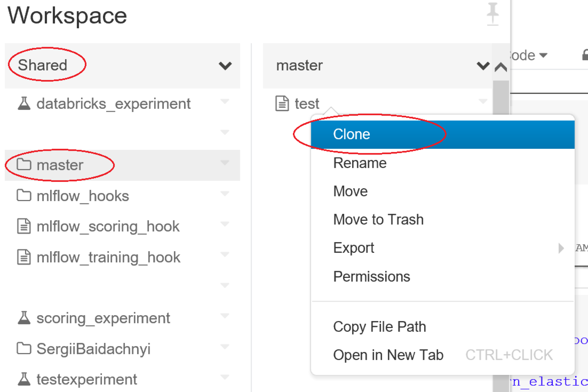
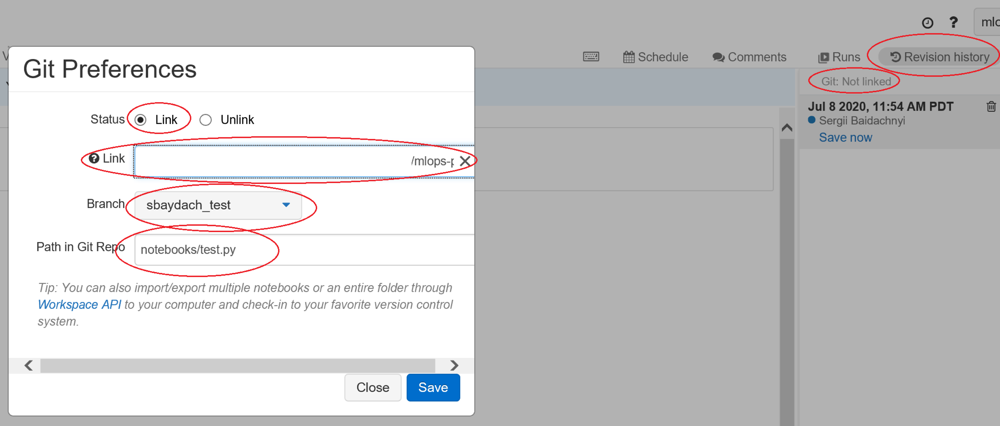
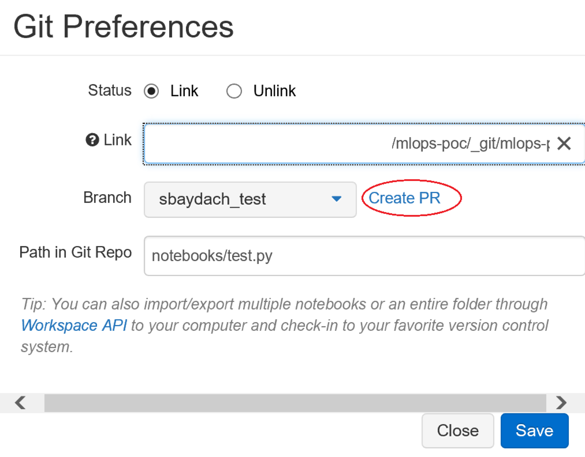
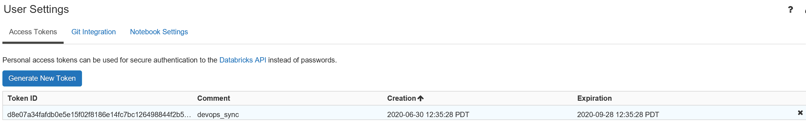

# How to use MLOps scripts and pipelines for Developers #

## Experimentation vs project development ##

In this project we are planning to use MLFlow to build pipelines for training and scoring as well as for model management and logging.

MLFlow introduces a concept called **projects** that can be treat as a reusable pipeline. A project itself is a folder that contains:

- scripts needed to execute pipeline steps
- MLProject file to define dependencies and step sequence
- conda dependencies to packages that should be installed on the compute cluster
- the compute cluster details to execute the experiment

Each project is a set of files that should be developed using standard software engineering tools (i.e. VS Code, PyCharm) rather than Databricks UI.

At the same time, it is a good practice to start testing notebooks in an experimental directory, `notebooks`, while storing more mature notebooks in a separate folder, `projects`.

- `notebooks` folder: to host all notebooks with your experiments that we are not going to push to production but we are using for future MLFlow projects;
- `projects` folder: contains all MLFlow projects (i.e. training and scoring) that we are planning to operationalize and deploy to production as completed artifacts

## Developing experiments in the notebooks folder ##

### Managing notebooks from Databricks UI ###

This approach supports staying within the Databricks UI to develop experiments.

First, we run a pipeline (`mlops_sync_notebooks_master.yaml`) from DevOps to maintain the current version of the `notebooks` folder with the `master` branch. So, if you would like to start working with an existing notebook, you can find all code from master in the `/Shared/master` folder. From here, you can clone an existing notebook to your personal folder:



Once you have the notebook in your folder, you can link it to your own branch. To do this, you can use the `Revision History` tab and click on `Git: Not linked` link:



The window above allows you to create a new branch. **Just make sure that if you edit an existing notebook, it will go to the same folder as in the `master` branch**.

Once you finish editing, you can sync the notebook with your branch (commit changes) and create a pull request:



Obviously, if you would like to create a new notebook rather than editing an existing one, the sequence of steps is the same except of cloning.

### Managing notebooks from a local computer ###

Alternatively, we provide a way to work with git from any IDE on your computer (VS Code or PyCharm is a good option for this project). It makes sense if you are developing not just Databricks notebooks but other components including documentation, MLFlow projects, or common libraries.

To start, you need to clone the project repository to your computer and create a feature branch. By doing that, you can complete your non-Databricks tasks in a standard way doing commits from IDE directly.

If you would like to start doing some coding in DataBricks you need to push the `notebooks` folder from your feature branch there. We have developed two scripts (`databricks-sync/to_databricks.py` and `databricks-sync/from_databricks.py`) that allow you to move all your notebooks to a DataBricks folder with your branch name and back. Using this approach, you can create a unique set of notebooks that will be associated with your branch. Once you complete the changes in the DataBricks, you can move the files back.

The script `from_databricks.py` does not take in any arguments, but the `to_databricks.py` has an optional argument `--overwrite`. This parameter allows you to avoid overwriting existing files in DataBricks by mistake. To run the script, you need to create the following environment variables beforehand:

- `DATABRICKS_HOST`: The host name of DataBricks server
- `DATABRICKS_TOKEN`: The access token to access DataBricks
- `NOTEBOOK_FOLDER`: A folder to sync from the local computer
- `USER`: A user name (uses the USERS/USER folder to copy notebooks)
- `PROJECT_FOLDER`: The root folder where the project is located on the local computer
- `MLFLOW_TRACKING_URI`: Should be `databricks`. We are using this variable to redirect MLFlow to the right direction.

The environment variables can be created using `SET` command on Windows or `EXPORT` command on Mac, but we recommend to use the `.env` file. We have this file in `.gitignore` to avoid pushing it by mistake. You can use the `env.sample` as a template for your own .env file.

Next, you will need to retreive a Databricks access token. You can use **User Settings** in the Databricks workspace to make or use your own token:



Once you have all environment variables you need to make sure that your Python environment is based on Python 3.7 or later and you have installed all packages from `databricks-sync/requirements.txt`. Once this is done, your environment is ready to execute the the scripts.

**Be sure to perform the steps above only once**. In all other feature branches you will be able to use an existing configuration.

To run the scripts, you need to open your console in the project root folder and execute the following command:

```bash
python databricks-sync/to_databricks.py
```

or

```bash
python databricks-sync/from_databricks.py
```

You will be able to see all information on the console about which files are copied and where.

## Developing MLFlow projects in the projects folder ##

MLFlow project is a core piece of the MLOps implementation. Each MLFlow project represents a pipeline, and we have at least two of them: training and scoring.

In order to develop MLFlow projects you need to a tool like Visual Studio Code. At the same time you need a way to test the projects from your local development environment as well as from DevOps. So, this section is primarily about what you need to do to ensure that your MLFlow projects run smoothly.

First off, you need to prepare your local development environment, where you need to install Python 3.7 or later and packages that you can find in the `mlflow_triggers/requirements.txt` folder. Then, follow instructions from [this section](mlops_developers.md#managing-notebooks-from-a-local-computer) to setup an `.env` file.

Finally, execute:

```bash
python mlflow_triggers/start_training_devops.py
```

to start training project, or

```bash
python mlflow_triggers/start_scoring_devops.py
```

to start scoring project.

Both scripts will create experiments in `/Shared/{user}/{branch_name}` folder. So, you will always will be able to find your experiment and look at the history for any particular branch.

**If you would like to test a scoring project**, be sure to execute training first to have a model in the MLFlow model registry.

Commit all your changes and create the pull request from Azure DevOps interface. In this case, we have a branch policy that should be satisfied prior to merging your changes to `master` and that is based on `mlops_run_pipelines_pr.yml` pipeline. In fact, the `mlops_run_pipelines_pr.yml` executes both `start_training_devops.py` and `start_scoring_devops.py` from the `mlflow_triggers` directory to make sure that they are valid. If you would like to test the scripts from the DevOps environment even prior to creating a PR, you can trigger `mlops-runpipelines-pr` Build manually (just go to Pipelines tab and trigger the pipeline on your feature branch).

## Scheduling Training and Scoring execution using hook notebooks ##

There are two more scripts that are used to schedule jobs to run training and scoring automatically: `mlflow_hooks/mlflow_training_hook.py` and `mlflow_hooks/mlflow_scoring_hook.py`.
