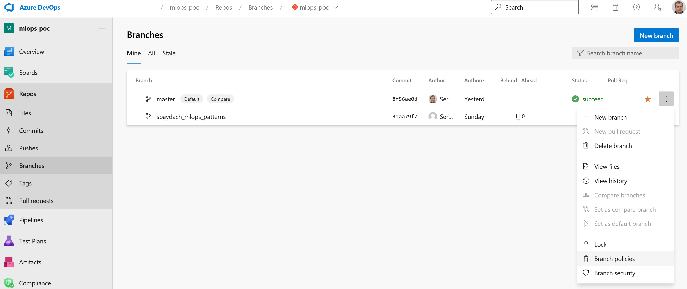
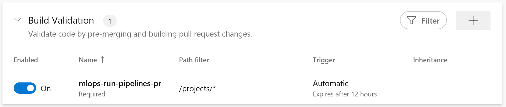

# How to setup MLOPs pipelines in a new DevOps instance #

The goal of this document is to provide a list of manual steps that should be implemented to setup MLOps pipelines in a new Azure DevOps environment. In this document we are making the assumption that the repository is already in Azure DevOps.

## Step 1. Setup variable groups ##

Two variable groups are created prior to configuring the pipelines: `mlops-vg` and `mlops-vg-pr`. These variables groups are used to setup a connection between Azure DataBricks and the Azure DevOps Build pipelines. The first variable group (`mlops-vg`) is required for all pipelines executing on master branch and the second variable groupe (`mlops-vg-pr`) executes on pull requests related pipelines on feature branches.

To create the variable groups you can use Pipelines -> Library tab:

Each variable group has the following set of parameters:

- `DATABRICKS_HOST`: full DataBricks workspace name starting from https (i.e. https://<name>.azuredatabricks.net);
- `DATABRICKS_TOKEN` (**change type to secret**): this is a personal access token that should be generated in DataBricks manually. It can be done using User Settings page in DataBricks

The reason why we are using two variable groups here is to support two different DataBricks environment for toy experimentation and to test pipelines on master branch. The DataBricks workspace that we are pointing in `mlops-vg-pr` should be used for all handmade experiments on feature branches triggered by pull requests. The DataBricks workspace in `mlops-vg` should only be used to run experiments only in master branch.

**In the case if we are planning to use just one DataBricks workspace** for all experiments you can just provide the same parameters for the host name and the token. We do not recommend to merge the variable groups in the case that additional parameters are introduced (i.e. using toy dataset folder for pull request runs or scheduling parameters for master runs).

## Step 2. Setup Build Pipelines ##

As for now we have three Build pipelines in the repository:

- `mlops_run_pipelines_pr.yml`:
- `mlops_sync_hooks_master.yml`:
- `mlops_sync_notebooks_master.yml`:

We need to use these yaml files to create Build pipelines in Azure DevOps.

- `mlops_run_pipelines_pr.yml`: is running once there is a pull request to `master` branch and the pull request contains changes in `projects` folder
- `mlops_sync_hooks_master.yml`: running on master branch in the case of any changes in the `mlflow-hooks` folder
- `mlops_sync_notebooks_master.yml`: running on master branch in the case of any changes in the `notebooks` folder

## Step 3. Setup a policy on master branch ##

Most of the Build pipelines are executed automatically. The `mlops_sync_hooks_master.yml` and the `mlops_sync_notebooks_master.yml` Build pipelines just copy data, but the `mlops_run_pipelines_pr.yaml` is responsible for code quality and is important to test all changes of MLFlow projects. So, it is something that we have to use for any pull request as a policy.

To add `mlops_run_pipelines_pr.yml` as a policy, navigate to Repos -> Branches and pick `Branch Policies` from an action menu of the `master` branch.

On the page we need to create a policy using the Build Validation section:

To create a new one you need to pick a Build that is associated with `mlops_run_pipelines_pr.yml` and setup the `Path filter` to `/projects/*`. In fact, the path filter replicates include element content from the yaml file itself.

Once you create the policy, the Build will be required for all pull requests that affect the projects folder.

The repository is now ready to support MLOps practices!
